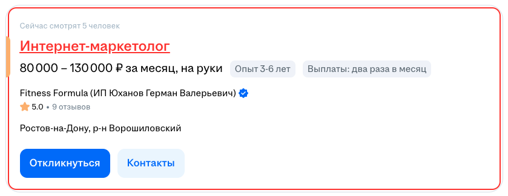

# HH Visited Highlighter 🚀

**HH Visited Highlighter** — это лёгкое браузерное расширение для Chrome, которое подсвечивает все посещённые вакансии и резюме на [hh.ru](https://hh.ru) красным цветом.  
Больше никакой путаницы: вы всегда будете видеть, где уже были!  

---

## ✨ Возможности
- Красная подсветка **заголовка вакансии/резюме**.  
- Красная рамка вокруг всей карточки.  
- Работает даже если ссылка на hh.ru «меняется» (динамические параметры).  
- Подсветка сохраняется при обновлении страницы.  

---

## 📸 Скриншоты

До:  


После:  


## ⚙️ Установка вручную
Пока расширение не опубликовано в Chrome Web Store, его можно установить вручную:

1. Скачай архив с расширением или клонируй репозиторий:
   ```bash
   git clone https://github.com/yourname/hh-visited-highlighter.git
   ```
2. Открой Chrome и перейди на `chrome://extensions/`.  
3. Включи **Режим разработчика** (справа вверху).  
4. Нажми **Загрузить распакованное расширение** и выбери папку с проектом.  
5. Готово 🎉 Теперь все посещённые ссылки на hh.ru будут подсвечиваться.  

---

## 📌 Планы
- Добавить настройку цвета подсветки.  
- Добавить popup-меню для управления (вкл/выкл).  
- Опубликовать в [Chrome Web Store](https://chrome.google.com/webstore).  

---
## 🚀 Roadmap

**v1.0**
- Подсветка просмотренных вакансий и резюме на hh.ru.
- Manifest v3.
- Иконки, README, скриншоты.

**v1.1**
- Исправлены баги с иконками.
- Добавлена заливка.

**v1.2**
- Настройки: выбор цвета и стиля подсветки.
- Popup (иконка в браузере) с быстрым включением/выключением.

**v1.3 (средний горизонт)**
- Экспорт/импорт настроек (JSON).
- Поддержка других сайтов (например, Superjob).
- Улучшенный интерфейс настроек.

**v2.0 (будущее)**
- Публикация в Chrome Web Store.
- Поддержка Firefox Add-ons.
- Отображение даты последнего просмотра вакансии.
- Разные цвета: просмотренные, откликнутые, скрытые.
- Кнопка «Поддержать проект» (ЮMoney).

---

## 🛠️ Технологии
- Manifest V3  
- JavaScript (Content Scripts)  
- LocalStorage  

---

## 🤝 Поддержка
Если расширение оказалось полезным — поставьте ⭐ на GitHub и поделитесь с друзьями 😉
